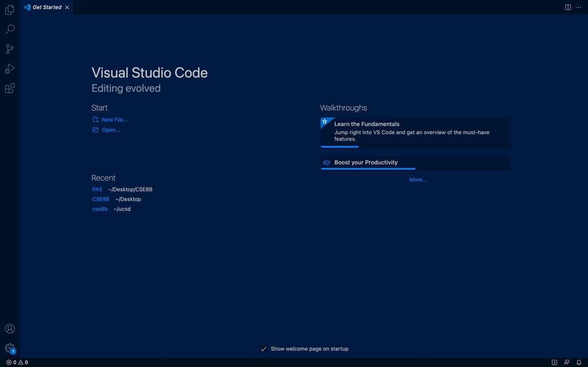
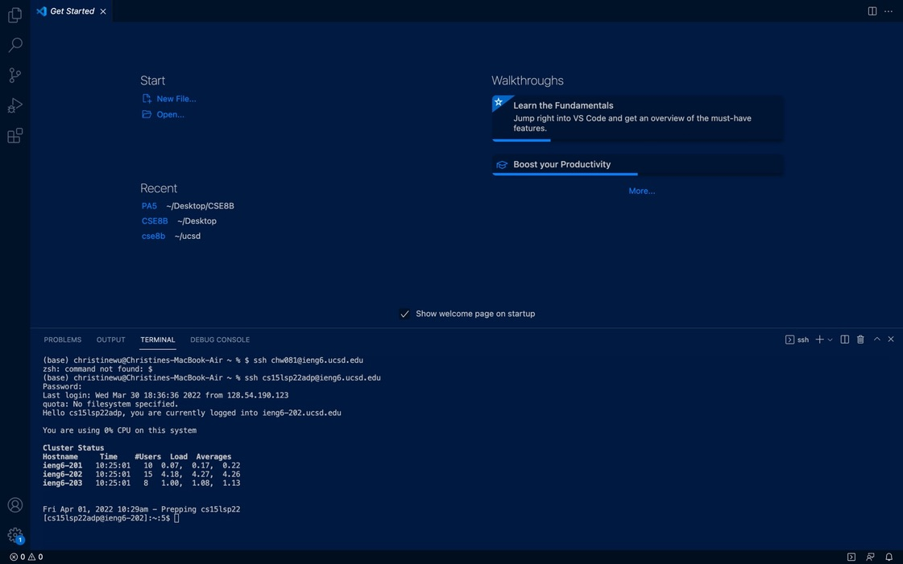
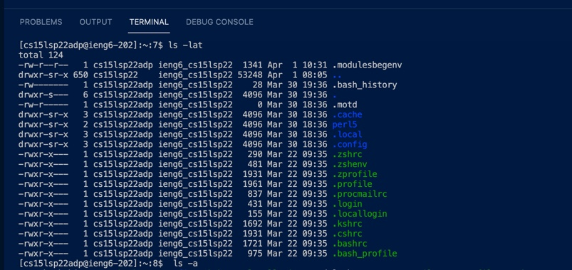
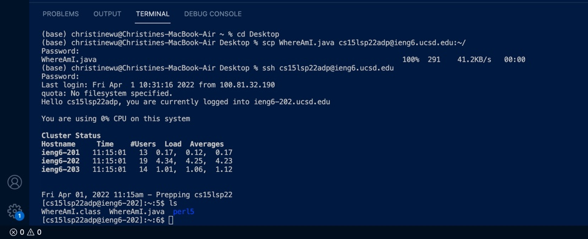
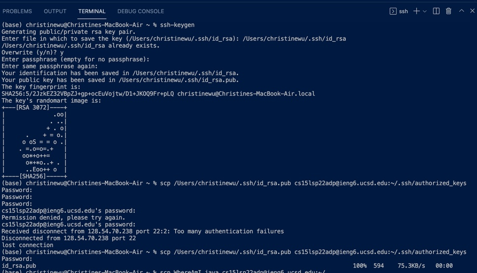
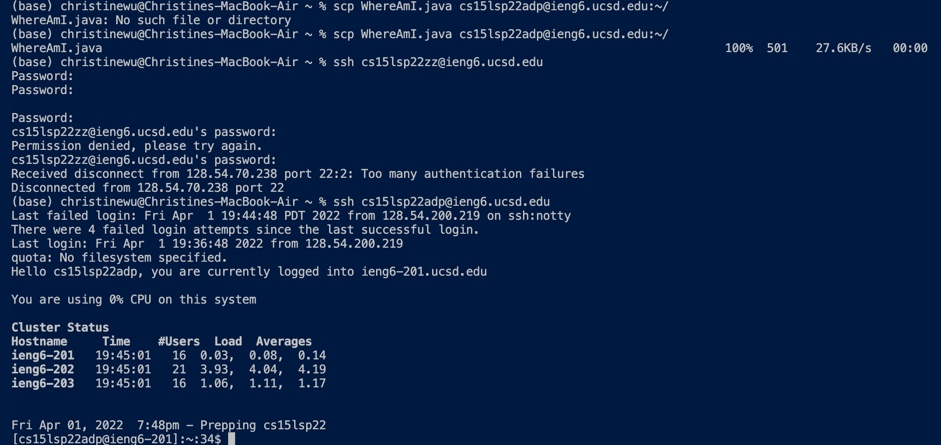
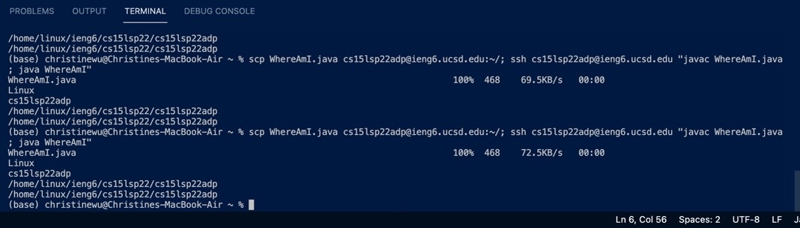

# Week2 Lab Report
## Installing VScode
Go to **Visual Studio Webpage** [click here](https://code.visualstudio.com/) and follow instructions to install on your device.



## Remotely Connecting
This step connects our device to a remote computer.

1. Know your course account
2. Open the terminal in your VScode
3. Use the code below and replace "zz" with your account name
``` 
ssh cs15lsp22zz@ieng6.ucsd.edu
```

4. Answer yes to the messages you recieve and then type your password when it is being asked



## Trying Some Commands
Now we can try some commands and understand their meanings so that we can get around the terminal more effciently in the future. 
* __cd directoryname__ (move to a directory, to move up use ..)
* __ls directoryname__ (displays files in the given directory; type only ls to see explicit files in the current directory; type -a all files, including hidden files in the current directory; -lat shows all the files, including hidden ones, with more information on each one and puts them in time order.)
* __cat filename__ (displays all contents in the given file)
```
cd directoryname 
ls directoryname 
cat filename
```



## Moving Files with scp
1. Create the file for later use
2. Use command line 
```
scp WhereAmI.java cs15lsp22zz@ieng6.ucsd.edu:~/
```



## Setting an SSH Key
Using an public SSH key allows the user to enter their computer without a password. 
1. use the code below without the $ to get the public key
```
$ ssh-keygen
```
2. enter the file path of the file that you want to save the key to
```
/Users/usernamehere/.ssh/id_rsa
```
3. press enter a few times until you see codes like the following:




## Optimizing Remote Running
Using procedures to skip entering password, combine commands in one line and repeat previous command.

