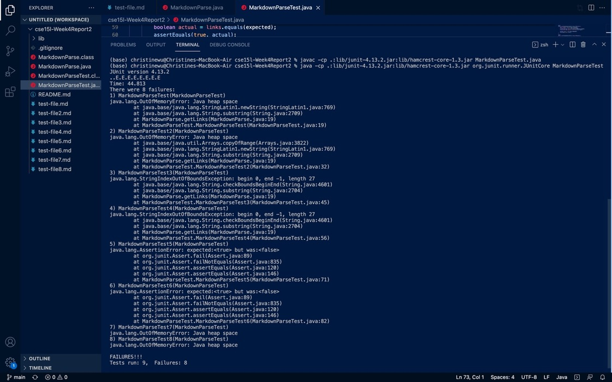
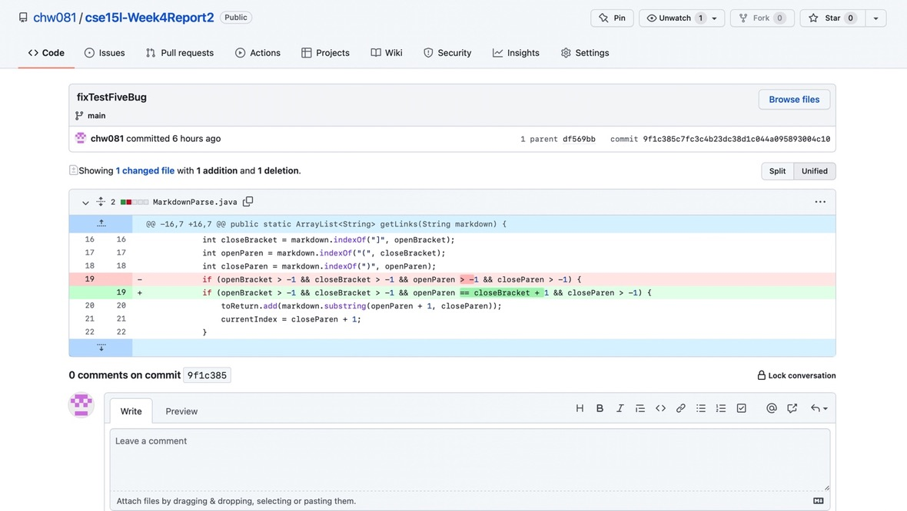
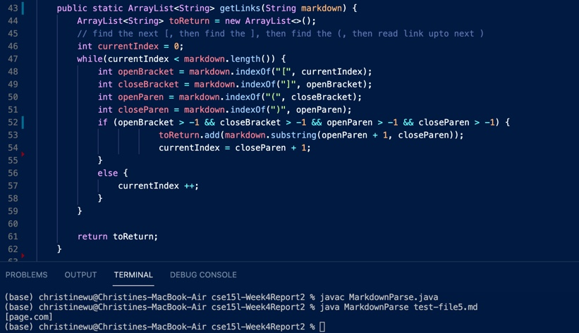
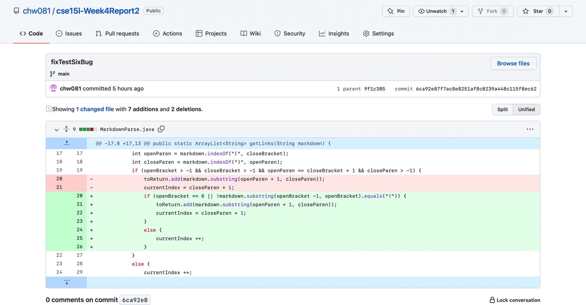
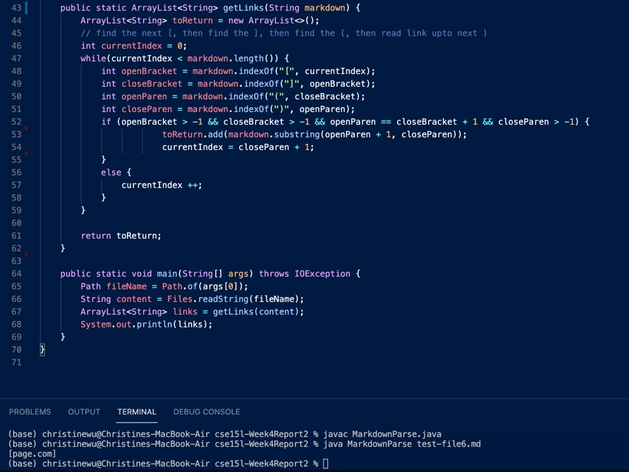
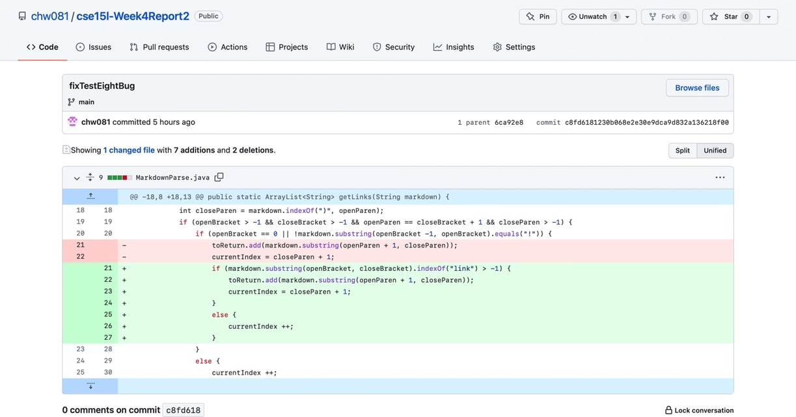
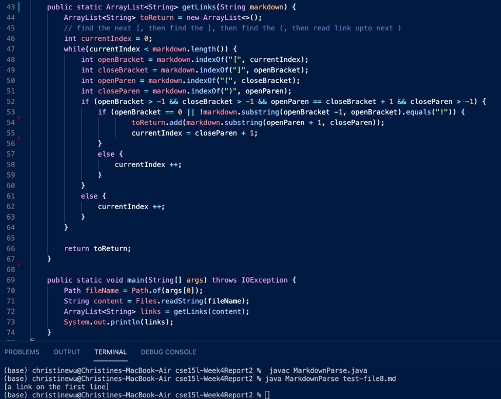

# Week2 Lab Report
## Set-up
First, fork the main repository or copy the files to make your own version. Move the files you got into your repository.

[*moveFileToRepo*](https://github.com/chw081/cse15l-Week4Report2/commit/61d76bc72dc10afc47df1ffcd105baaee240229b)

Then, make the test cases for later testing. These Junit tests help users to identify bugs.

[*updateJUnitTestCase*](https://github.com/chw081/cse15l-Week4Report2/commit/346e709dd024d21cd0f075ea85f7e0838b2f0917
)

Then run the codes using the following comand line.

```
javac -cp .:lib/junit-4.13.2.jar:lib/hamcrest-core-1.3.jar MarkdownParseTest.java
java -cp .:lib/junit-4.13.2.jar:lib/hamcrest-core-1.3.jar org.junit.runner.JUnitCore MarkdownParseTest 
```

This would be an example of successfully compiling the files using the original MarkdownParse.java.



## Basic Cases
These changes would help pass most cases. This process checks if brackets and parentheses exists in the string.
 
[*checkBracketExist*](https://github.com/chw081/cse15l-Week4Report2/commit/596930e80f3c991b78f2efc48fd0d7c28ea2b19f)

[*mistakeInIndexLimit*](https://github.com/chw081/cse15l-Week4Report2/commit/df569bbd093191af96dbbe9ce47a4f3cfe3d42c8)

Then it moves the current index to the next if the condition for the brackets and parentheses are not met.

[*updateCurrentIndex*](https://github.com/chw081/cse15l-Week4Report2/commit/ef97a9aa36e6781ccfc0aea088c6cdd99fdb7c17)

## Code Change 1: URL not Following Link Reference
Screenshot for code change:

[fixTestFiveBug](https://github.com/chw081/cse15l-Week4Report2/commit/9f1c385c7fc3c4b23dc38d1c044a095893004c10)


Link to test file 5:

[test-file5.md](https://github.com/chw081/cse15l-Week4Report2/blob/main/test-file5.md)

Symptom and output:



Relationship between symptom, bug, and input:
The input has paired brackets first and then paired parentheses, which would make it an available link using the code. However, they are not next to each other. They are seperated by other characters and so it should not be counted as a correct link.

## Code Change 2: Identify Image Code
Screenshot for code change:

[*fixTestSixBug*](https://github.com/chw081/cse15l-Week4Report2/commit/6ca92e87f7ac8e8251af8c0239a448c115f8ec62)


Link to test file 6:

[test-file6.md](https://github.com/chw081/cse15l-Week4Report2/blob/main/test-file6.md)

Symptom and output:



Relationship between symptom, bug, and input:
The input has paired brackets first, paired parentheses and they are also connected with each other, which would make it an available link using the code. However, this would be a reference for an image since there is a "!" before the brackets. So it should not be counted as a correct link.

## Code Change 3: No link in Bracket
Screenshot for code change:

[*fixTestEightBug*](https://github.com/chw081/cse15l-Week4Report2/commit/c8fd6181230b068e2e30e9dca9d832a136218f00)


Link to test file 8:

[test-file8.md](https://github.com/chw081/cse15l-Week4Report2/blob/main/test-file8.md)

Symptom and output:



Relationship between symptom, bug, and input:
The input has paired brackets first and paired parentheses that are connected with each other, and is not an image coding, which would make it an available link using the code. However, there is nothing in the paired brackets. Since it is empty and does not contain the word link like other successful cases, it should not be counted as a correct link.
