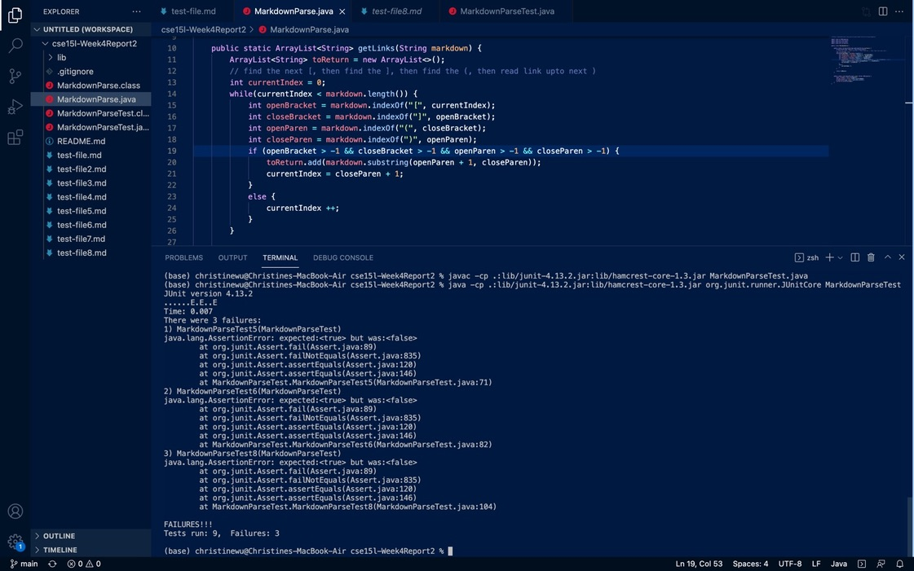
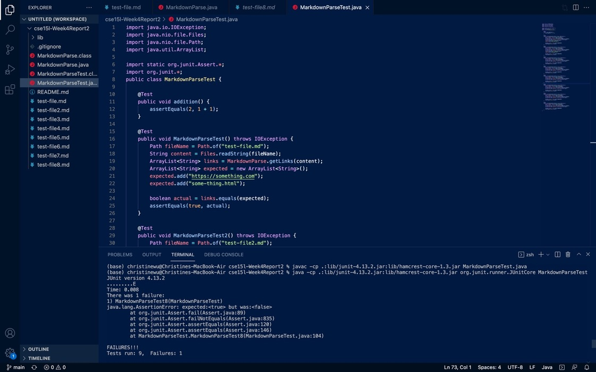

# Week2 Lab Report
## Set-up
First, fork the main repository or copy the files to make your own version. Move the files you got into your repository.

[*moveFileToRepo*](https://github.com/chw081/cse15l-Week4Report2/commit/61d76bc72dc10afc47df1ffcd105baaee240229b)

Then, make the test cases for later testing. These Junit tests help users to identify bugs.

[*updateJUnitTestCase*](https://github.com/chw081/cse15l-Week4Report2/commit/346e709dd024d21cd0f075ea85f7e0838b2f0917
)

Then run the codes using the following comand line.

```
javac -cp .:lib/junit-4.13.2.jar:lib/hamcrest-core-1.3.jar MarkdownParseTest.java
java -cp .:lib/junit-4.13.2.jar:lib/hamcrest-core-1.3.jar org.junit.runner.JUnitCore MarkdownParseTest 
```

This would be an example of successfully compiling the files using the original MarkdownParse.java.


## Basic Cases
These changes would help pass most cases. This process checks if brackets and parentheses exists in the string. 
[*checkBracketExist*](https://github.com/chw081/cse15l-Week4Report2/commit/596930e80f3c991b78f2efc48fd0d7c28ea2b19f)

[*mistakeInIndexLimit*](https://github.com/chw081/cse15l-Week4Report2/commit/df569bbd093191af96dbbe9ce47a4f3cfe3d42c8)

Then it moves the current index to the next if the condition for the brackets and parentheses are not met.

[*updateCurrentIndex*](https://github.com/chw081/cse15l-Week4Report2/commit/ef97a9aa36e6781ccfc0aea088c6cdd99fdb7c17)

## Code Change 1: URL not Following Link Reference
[*fixTestFiveBug*](https://github.com/chw081/cse15l-Week4Report2/commit/9f1c385c7fc3c4b23dc38d1c044a095893004c10)




## Code Change 2: Identify Image Code
[*fixTestSixBug*](https://github.com/chw081/cse15l-Week4Report2/commit/6ca92e87f7ac8e8251af8c0239a448c115f8ec62)


## Code Change 3: No link in Bracket
[*fixTestEightBug*](https://github.com/chw081/cse15l-Week4Report2/commit/c8fd6181230b068e2e30e9dca9d832a136218f00)



