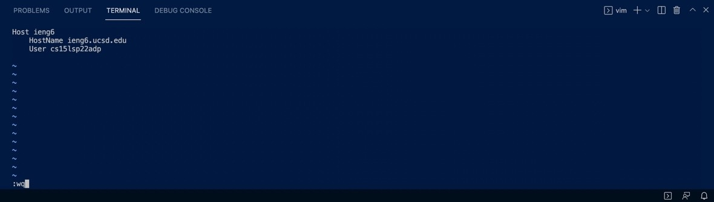
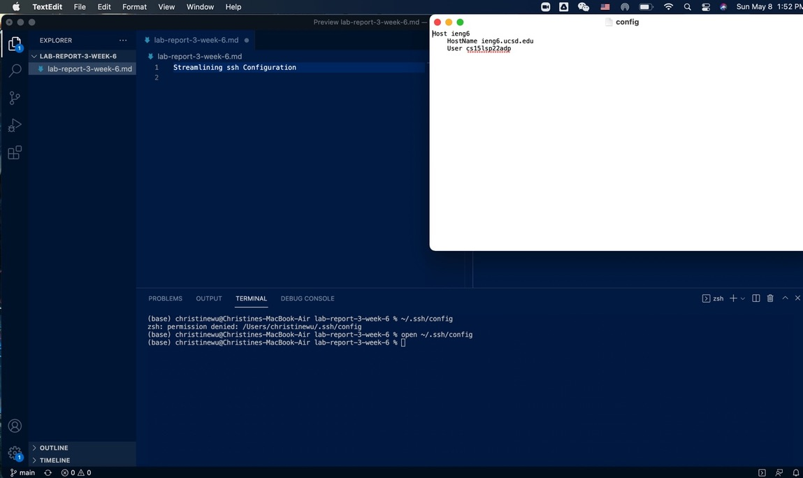
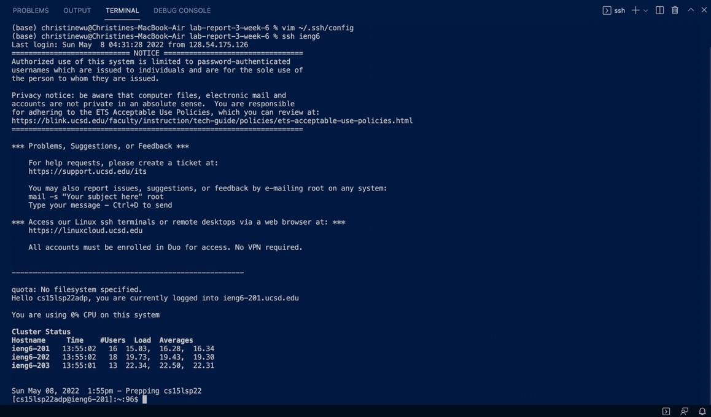
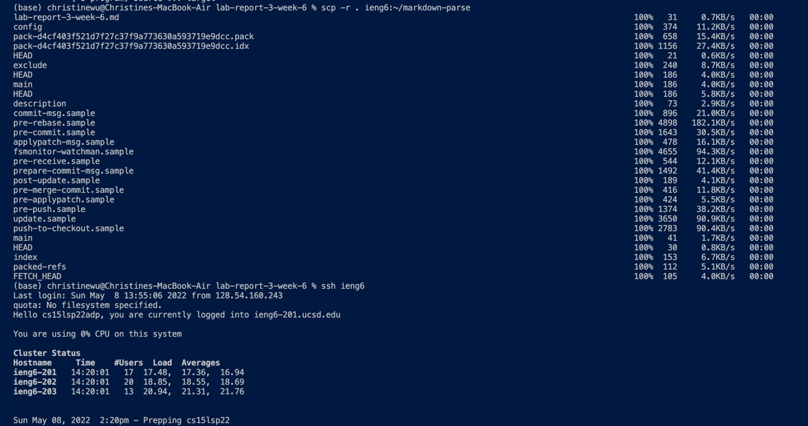
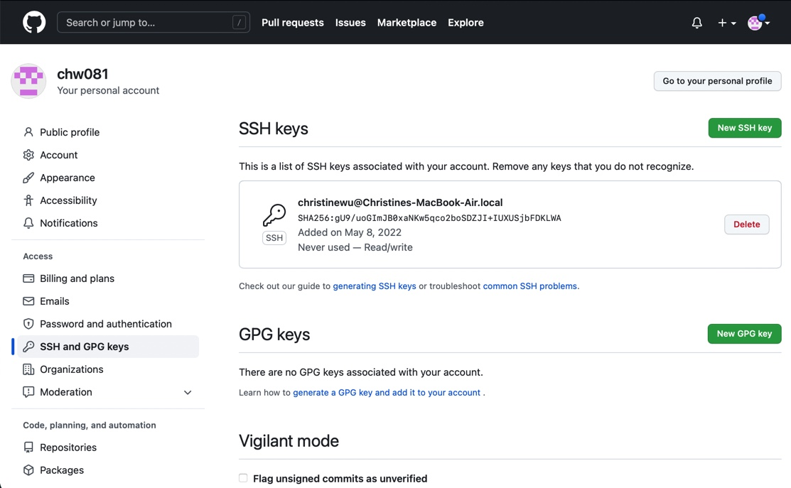
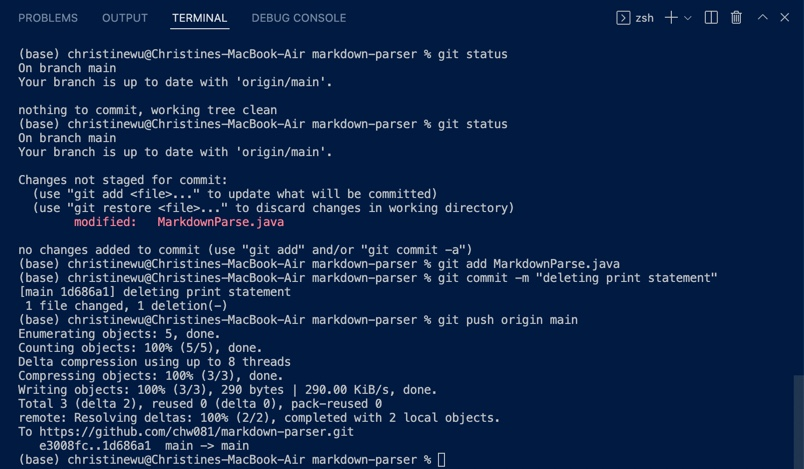
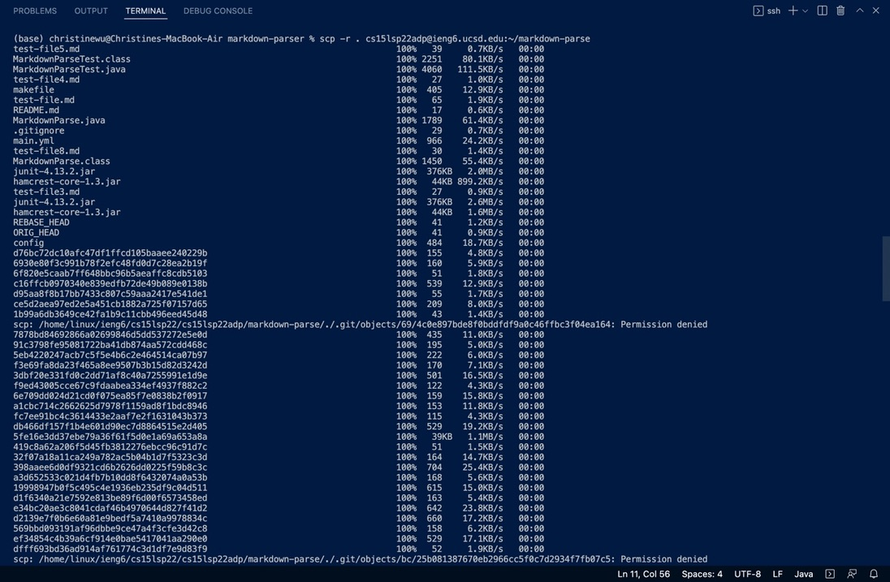
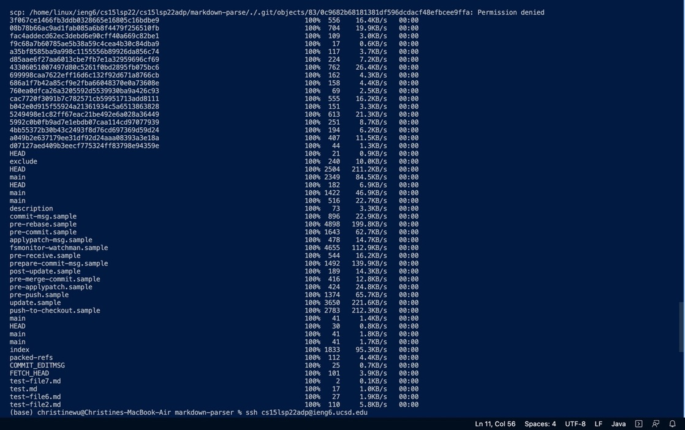
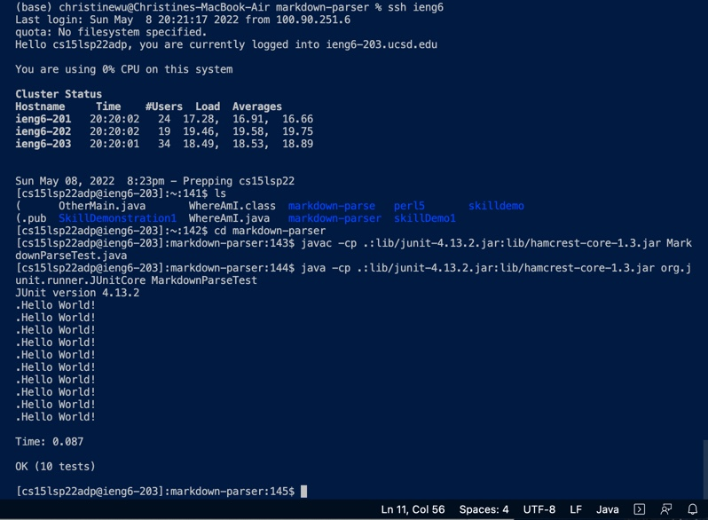
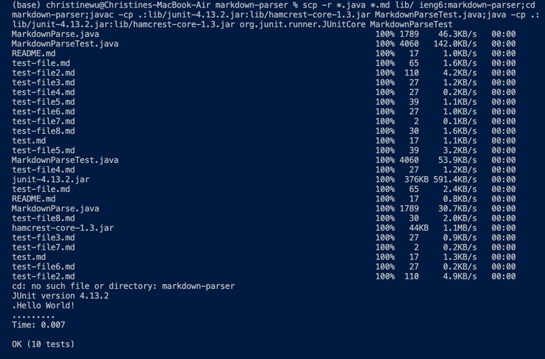

# Week6 Lab Report3
## Streamlining ssh Configuration
1. editing .ssh/config file using the following code

```
~/.ssh/config
```

if exist, then open file:

```
open ~/.ssh/config
```

if not, then create new file:

```
vim ~/.ssh/config
```

Inside the file type the following code:

```
Host ieng6
    HostName ieng6.ucsd.edu
    User cs15lsp22zzz (use your username)
```


The result will be something like this:



2. using ssh to log into the account using

```
ssh ieng6
```

a similiar output of the following code should be expected:



3. using scp to copy file into the account, and in this example the code is:

```
scp -r . ieng6:~/markdown-parse
```



## Setup Github Access from ieng6
1. public key stored on github by using the following command to get the key:

```
pbcopy < ~/.ssh/id_rsa.pub
```



2. To find the path for copying, we see that the public and private key stored in user account, both under .ssh folder


3. First we check the status and see that there is one change that should be pushed and commited. Then we use git add, git commit, and git push to get the change to the origin:



4. this is the link to the resulted commit:

[*link to result*](https://github.com/chw081/markdown-parser/commit/1d686a1f7b42a85cf9e2fba66048370e0a73608e)

## Copy whole directories with scp -r
1. copying the whole markdown-parse directory to ieng6 account:

```
scp -r . cs15lsp22adp@ieng6.ucsd.edu:~/markdown-parse
```




2.  logging into ieng6 account and compiling and running the tests for the repository



3. combining scp, ;, and ssh to copy the whole directory and run the tests in one line

