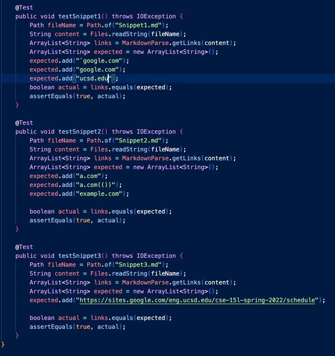

# Week8 Lab Report
## Link to two repository
[Christine's repo](https://github.com/chw081/markdown-parser)
[Week7's repo](https://github.com/charvishukla/markdown_parser_2)
## Test
1. Output for each test

    Snippet 1: 
    
    `google.com google.com ucsd.edu
    
    Snippet 2:
    
    a.com a.com(()) example.com

    Snippet 3:
    
    https://sites.google.com/eng.ucsd.edu/cse-15l-spring-2022/schedule

2. Code for testing

    MarkdownParseTest code:
    
    Example code:
    ```
    @Test
    public void testSnippet3() throws IOException {
        Path fileName = Path.of("Snippet3.md");
        String content = Files.readString(fileName);
        ArrayList<String> links = MarkdownParse.getLinks(content);
        ArrayList<String> expected = new ArrayList<String>();
        expected.add("https://sites.google.com/eng.ucsd.edu/cse-15l-spring-2022/schedule");

        boolean actual = links.equals(expected);
        assertEquals(true, actual);
    }
    ```

3. Christine Implementation Results

    Failures:
    

    Conclusion:
    My code doesn't work for any of the tests.

4. Week7 Implementation Results

    Failures:
    

    Conclusion:
    This code doesn't work for any of the tests.

## Questions and Answer

1. Snippet1
    It is not very possible to fix this issue with in 10 lines of code. This is because we need to check for all backticks and we don't know if they are pair or in odd number. Additionally, the contents inside the backticks should not be checked for bracket or parentheses. So first we have to identify if backticks ranges. Inside the range we need to check for [, ], and ( respectively. Then if we indeed did find these symbols inside, we need to skip it and find the next one. This requires a decent amount of work because there are too many situations and we have to procede differently according to different situations.
2. Snippet2
    It is not very possible to fix this issue with in 10 lines of code. We have to check for nested [] and () in both [] and (). This requires loops to check for the next open brackets and open parentheses in the range from the index of openBracket or openParen to its corresponding close symbol. However, to find the close symbol, we also need to write code inside the loop for checking the nested [] and (). This would definitely take a lot of work.
3. Snippet3
    It is possible to fix this issue with in 10 lines of code. I used two if statements to check for multiple new lines and add current index if they do. If they do not, we still need to eliminate the new line before and after the link and so I added a loop. These took 7 lines in total.

    ```
    if (markdown.substring(openBracket, closeBracket).indexOf("\n\n") == -1) {
        if (markdown.substring(openParen, closeParen).indexOf("\n\n") == -1) {
            String link = markdown.substring(openParen + 1, closeParen);
            while (link.indexOf("\n") > -1) { link = link.replace("\n", ""); }
        } else { currentIndex ++; }
    } else { currentIndex ++; }
    ```