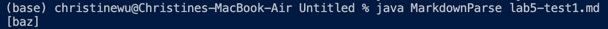

# Week10 Lab Report
## Finding tests with different result
1. code

to get the results, the following codes are used:

Once for each repository:
```
bash script.sh > results.txt
```

Compare using vimdiff:
```
vimdiff my-markdown-parser/results.txt cse15lsp22-markdown-parser/results.txt
```

2. tests

I decided to use test201 and test490

test 201: [test-case-201](https://github.com/chw081/markdown-parser/commit/e399df7da6df2780c1cd6cbed77ee360da44566b)


test 490: [test-case-490](https://github.com/chw081/markdown-parser/commit/c98c2ab409218a28909858c52c2fd1dd39d6956e)


## Link to the test files:

The two test files can be found in my markdown-parser repo:
[markdown-parser](https://github.com/chw081/markdown-parser)

test 201: [test-case-201](https://github.com/chw081/markdown-parser/commit/e399df7da6df2780c1cd6cbed77ee360da44566b)

test 490: [test-case-490](https://github.com/chw081/markdown-parser/commit/c98c2ab409218a28909858c52c2fd1dd39d6956e)

## Test 201:
1. Implementation

My markdown parser had the right output.

2. Expected Output

The preview shows there is no real link for this file, so the expected output should be an empty list, [].


3. Actual Output

My markdown-parser's output


Write-up 9 markdown-parse's output



4. Bug
Write-up 9 markdown-parse did not check the condition that the open parenthesis should be right next to the end brack. It should follow it like "](". If they are not next to each other, the content cannot be recognized as a vaild link. So, when finding the next openParen, we should check if closeBracket + 1 index is "(". If it is, then we go on checking for a valid link. If not, we start over and tries to find a the next open bracket again.

## Test 508:
1. Implementation

The markdown-parser from lab write-up 9 had the right output.

2. Expected Output

The preview shows there is no real link for this file, so the expected output should be an empty list, [].


3. Actual Output

My markdown-parser's output


Write-up 9 markdown-parse's output


4. Bug

My implementation of MarkdownParse file did not check if the content inside the parentheses is a true link. So <foobar> was not a link because the link content was put in seperate lines, even though the brackets and parentheses are in the right place and there exists contents in the brackets. So, my implementation should check for " " and "\n" in the link contents.